# Projects

Projects are the main organizational unit in IssuePit. Each project belongs to an **organization** and can have its own board, issues, milestones, and linked repositories.

---

## Creating a Project

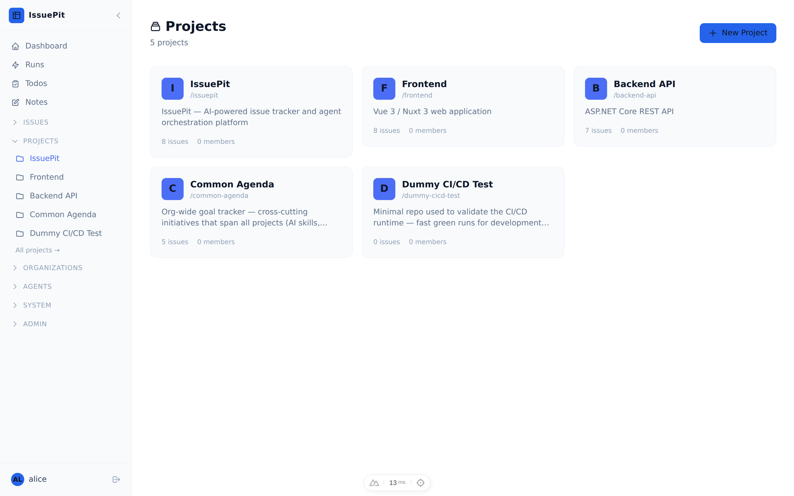

1. Navigate to the **Projects** section in the sidebar.
2. Click **New Project**.
3. Fill in the details:
   - **Name** — a short display name (e.g. `my-app`)
   - **Description** *(optional)* — what the project is about

   

4. Click **Create**.

Your new project appears in the project list immediately.

---

## Project Dashboard

Opening a project takes you to the **project dashboard** — a configurable overview of everything happening in the project.

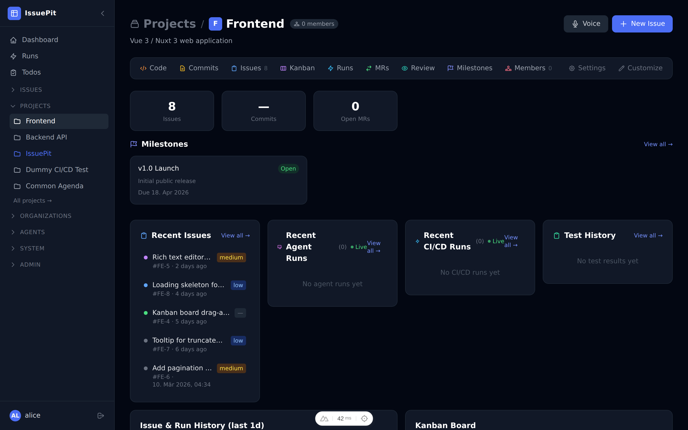

The dashboard includes compact pill stats (open issues, agent runs, CI/CD runs, members), a **Recent Issues** list, inline read-only kanban, recent agent and CI/CD run summaries, and an issue history feed.

### Customising the dashboard layout

Click **Customize dashboard** (bottom of the page) to enter **draft mode**. In draft mode:

- **Drag** any section header to reorder sections.
- Use the per-section config bar to change **display mode** (list / count / block), **max items**, and **width** (small / medium / large).
- **Hide** sections you don't need; restore them via the hidden sections row at the bottom.
- Group sections into **tab groups** — multiple sections share the same space and are switched via tabs.
- Click **Save** to persist the layout (stored per user in the browser), or **Cancel** to discard changes.

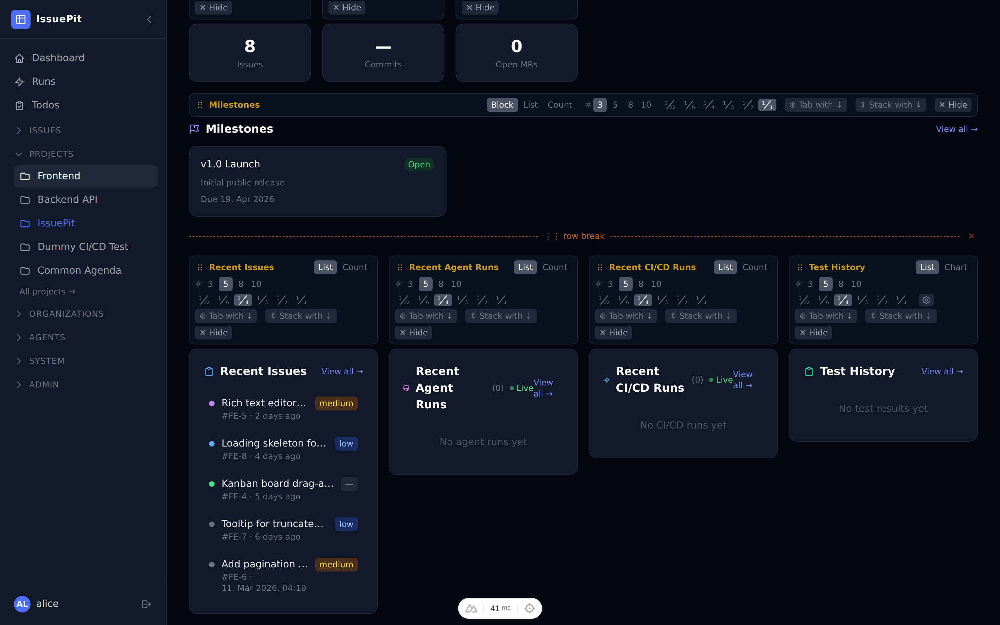

### Test History Chart Card

The **Test History** card can be switched between **list mode** (recent run table) and **chart mode** (interactive bar chart). In chart mode the settings cog exposes:

| Setting | Options |
|---------|---------|
| **Timeframe** | 7 – 60 days (number input) |
| **Branch** | All branches or a specific branch filter |
| **Color mode** | `Fail %` · `Pass/Fail` · `Groups` |
| **Y axis** | `Count` (test count) · `Time` (duration in seconds) |
| **X axis** | `Date` (one bar per calendar day, gaps for idle days) · `Runs` (one bar per CI run, no gaps, multiple runs per day OK) |

**Color modes:**

- **Fail %** — single bar whose color blends green → yellow → red proportional to the day's failure percentage.
- **Pass/Fail** — stacked green (passed) / red (failed) bar. In Time mode the bar height is the total duration, split proportionally green/red by the pass/fail test count ratio.
- **Groups** — stacked segments per test artifact name (e.g. `unit`, `integration`, `e2e`). Each group segment uses a stable hue that shifts toward dark red as that group's own failure rate increases. The legend shows each group's own gradient chip — vivid base color = healthy, dark red = failing.

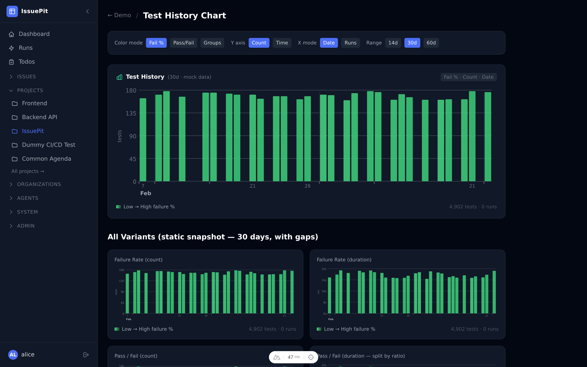

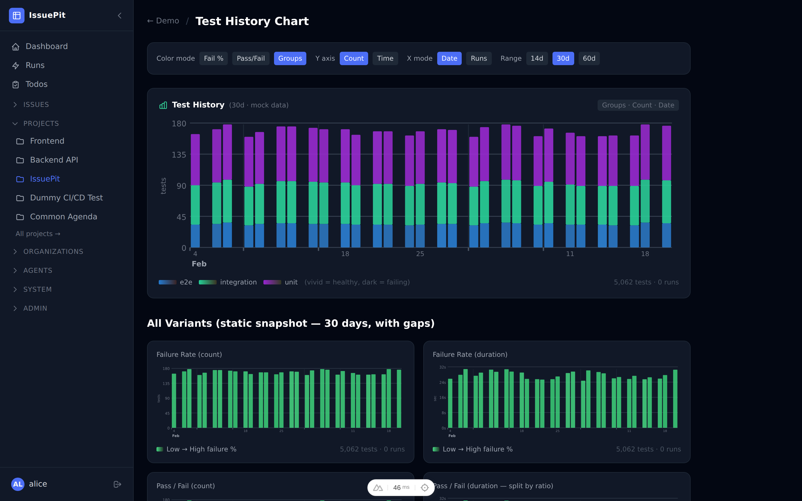

Multiple Test History chart cards can be placed on the same dashboard (e.g. one per branch) by dragging the **+ Test History** button from the draft-mode toolbar.

### Kanban Dashboard Card

The **Kanban Board** dashboard card shows an inline read-only kanban view. To add one (or more) to the dashboard:

1. Click **Customize dashboard** to enter draft mode.
2. Drag the **+ Kanban Board** button from the toolbar onto the layout, or click it to append it at the end.
3. Use the settings cog on the card to pick which board to display.

Each card is independent — you can place the same board twice or show different boards side by side.

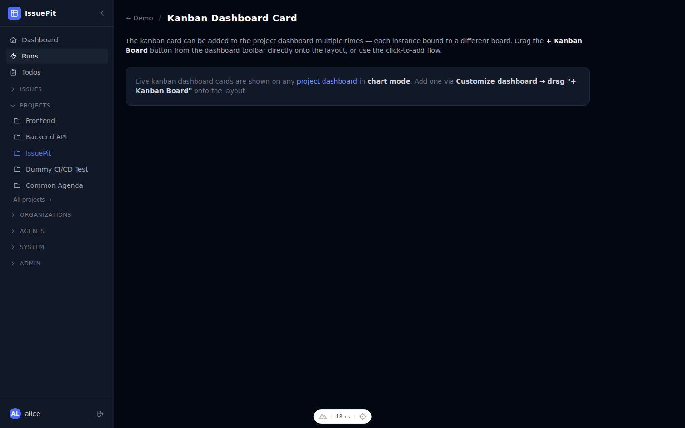

---

## Git Origins (Multiple Remotes)

A project can have **multiple git origins**, each with a different role:

| Mode | Description |
|------|-------------|
| **Working** | The primary remote. Agents push feature branches and open PRs here. |
| **Read-only** | Fetch-only mirror — never pushed to by agents or the release pipeline. |
| **Release** | Only the default/main branch is pushed here after an agent PR is merged. |

### Adding a Git Origin

1. Open your project.
2. Go to **Settings**.
3. In the **Git Origins** section, click **Add Origin**.
4. Fill in:
   - **Remote URL** — `https://github.com/org/repo.git` or `git@github.com:org/repo.git`
   - **Default branch** — e.g. `main`
   - **Mode** — choose Working, Read-only, or Release
   - **Username** / **Token** — optional credentials for private repositories
5. Click **Add Origin**.

You can add as many origins as needed. The first **Working** remote is used when agents clone the repository.

> **Breaking change (data migration):** Existing single-repository configurations are automatically migrated to `Working` mode.

### Git Remote Operations

Each configured origin exposes the following action buttons directly in the **Settings → Git Origins** section:

| Button | Description |
|--------|-------------|
| **Fetch** | Fetches the latest refs from the remote without modifying any local branch. |
| **Pull** | Fetches and fast-forwards the default branch to match the remote. |
| **Push** | Pushes the local default branch to the remote. Not available for *Read-only* origins. |
| **Sync** | Pulls then pushes the default branch (pull → push). Not available for *Read-only* origins. |

---

## GitHub Sync

Each project can be configured to synchronise issues with a GitHub repository. Navigate to **Project Settings → GitHub Sync** to configure.

### Configuration

| Field | Description |
|-------|-------------|
| **GitHub Identity** | A PAT (Personal Access Token) identity from [Config → GitHub Identities](/config/github-identities). Required for all sync operations. |
| **GitHub Repository** | Repository in `owner/repo` format (e.g. `acme/backend`). |
| **Trigger Mode** | `Off` (default) · `Manual` (trigger from the Sync page) · `Auto` (periodic automatic sync). |
| **Auto-Create on GitHub** | When enabled, new issues created in IssuePit are automatically pushed to GitHub. Disabled by default. |

### Importing Issues from GitHub

1. Open **Project Settings → GitHub Sync**.
2. Configure a GitHub identity and repository, then click **Save Configuration**.
3. Click **Trigger Sync Now** to import all open and closed issues from GitHub into this project.

Each GitHub issue is imported only once and linked via `GitHubIssueNumber`. A link to the original GitHub issue appears in the issue sidebar.

### Sync Runs (Audit Log)

Every manual or automatic sync creates a **sync run** record. Open the **Sync Runs** tab to:

- View the status (Pending / Running / Succeeded / Failed) and summary of each run.
- Click **View logs →** to inspect per-line audit output including which issues were imported, updated, or skipped.
- Trigger a new sync from this tab.

### Conflict Detection

The **Conflicts** tab compares linked issues in both systems and lists any where the title or body has diverged. Click **Open in IssuePit →** to resolve the conflict manually.

---

## Jira Sync

Each project can be configured to import issues from a Jira project. Navigate to **Project Settings → Jira Sync** to configure.

Jira sync is **read-only** — IssuePit only imports from Jira and never writes back to it.

### Required Permissions

The Jira API token must belong to a user with the following project permissions:

| Permission | Purpose |
|------------|---------|
| **Browse Projects** | Required to list and read issues. |
| **View Read-Only Workflow** | Required to read issue status. |
| **Service Desk Agent** | Only required when importing from a Jira Service Desk project. |

Create your API token at [id.atlassian.com](https://id.atlassian.com/manage-profile/security/api-tokens).

### API Key Setup

Before configuring Jira Sync, add a Jira API key in **Config → API Keys**:

1. Click **Add Key**.
2. Set **Provider** to `Jira`.
3. Fill in the **Jira Base URL** (e.g. `https://acme.atlassian.net`) and **Jira User Email** — these Jira-specific fields appear automatically when the Jira provider is selected.
4. Paste your Jira API token as the key **Value**.

### Configuration

| Field | Description |
|-------|-------------|
| **Jira Project Key** | The short key for the Jira project (e.g. `PROJ`, `ACME`). |
| **Jira API Token (Key)** | Select an API key with provider **Jira** from [Config → API Keys](/config/keys). The key must have the Jira Base URL and user email set. |
| **Parent Issue Keys** | Optional comma-separated list of Jira issue keys (e.g. `PROJ-1,PROJ-2`). When set, only direct child issues of those keys (e.g. sub-tasks under an Epic) are imported. Leave blank to import all issues in the project. |
| **Import issue comments** | When enabled, Jira comments are imported as IssuePit comments on the corresponding issue. |
| **Trigger Mode** | `Off` (default) · `Manual` (trigger from this page) · `Auto` (periodic automatic import). |

### Importing Issues from Jira

1. Add a Jira API key in **Config → API Keys** (provider: **Jira**) with the Jira Base URL and email filled in.
2. Open **Project Settings → Jira Sync**.
3. Fill in the Jira Project Key and select the API key.
4. Optionally enter **Parent Issue Keys** to limit imports to children of specific issues (useful for Epics).
5. Click **Save Configuration**, then **Trigger Import Now**.

Each Jira issue is imported only once (identified by its numeric Jira ID). A Jira-style issue key (e.g. `PROJ-123`) appears in the issue sidebar linking back to the original Jira issue.

### Import Runs (Audit Log)

Every manual or automatic import creates an **import run** record. Open the **Import Runs** tab to view status, summary, and detailed per-issue log output.

---

## Managing Boards

Each project has a **Kanban board** with the following columns by default:

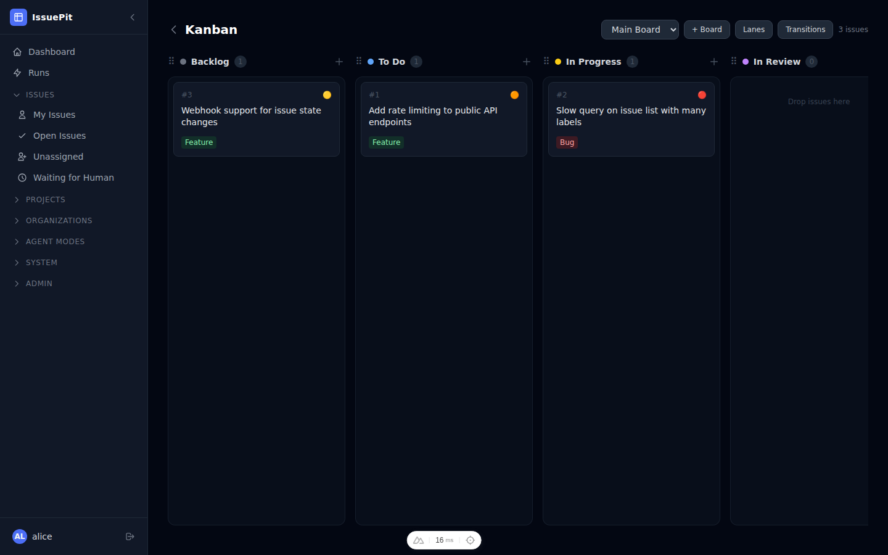

| Column | Meaning |
|--------|---------|
| Backlog | Not yet scheduled |
| Todo | Scheduled, not started |
| In Progress | Actively being worked on |
| In Review | Ready for code/human review |
| Done | Completed |

To reorder or rename columns, go to **Project Settings → Board**.

### Issue Preview Sidebar

Clicking any card on the Kanban board opens a **slide-in preview panel** on the right side. The panel shows the issue's status, priority, type, labels, assignees, milestone, and description excerpt. Click **Open Full Issue** to navigate to the full issue page, or click the × button or the backdrop to dismiss the panel.

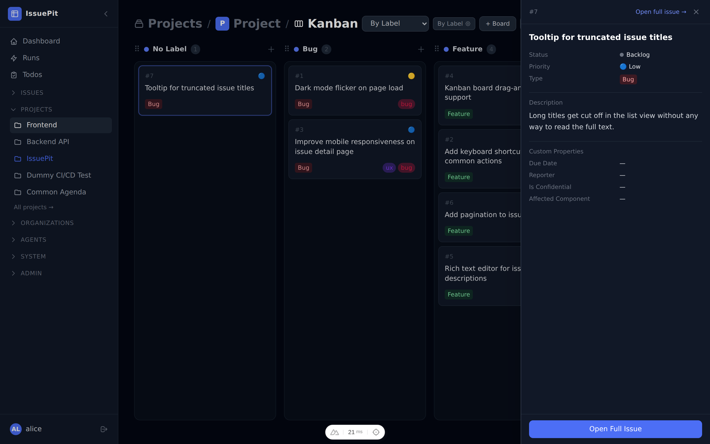

### Lane Properties

By default, Kanban columns group issues by **Status**. You can switch the active board's grouping to any of the following lane properties:

| Lane Property | Description |
|---------------|-------------|
| **Status** | Group by issue status (default) |
| **Priority** | Group by priority (Critical, High, Medium, Low, None) |
| **Label** | Group by assigned label |
| **Type** | Group by issue type |
| **Agent** | Group by assigned agent mode |
| **Milestone** | Group by assigned milestone |

To change the lane property, click **+ Board** and select the desired **Lane Property**, or view the active board badge in the toolbar to see the current grouping mode. Dragging an issue to a different column automatically updates the corresponding property on that issue.

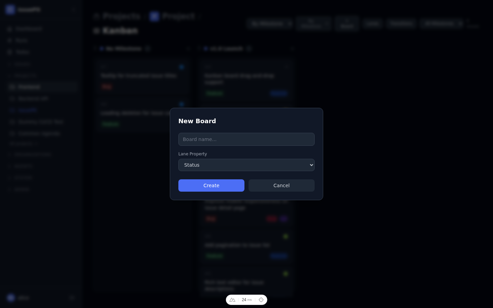

### Lane Transitions

The **Transitions** button in the board toolbar lets you define which column-to-column moves are allowed:

1. Click **Transitions** in the toolbar.
2. Click **Add Transition**.
3. Fill in the **Name**, **From** column, **To** column, and optionally enable **Auto-trigger** (for agent-driven moves).
4. Click **Save**.

When transitions are defined, invalid drop targets are visually grayed out during a drag. When no transitions are defined the board is open — any drag is allowed. The Transitions button pulses amber when dragging from a column that has no outgoing transitions configured.

### Custom Issue Properties

Projects can define **custom properties** to capture structured data beyond the built-in fields (status, priority, type, etc.).

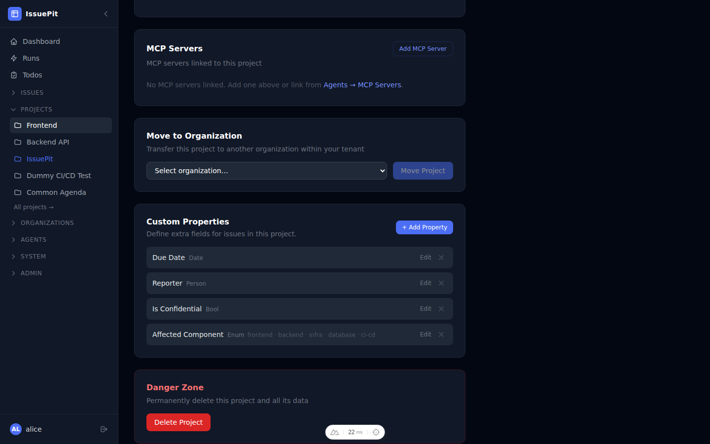

#### Adding a custom property

1. Open your project.
2. Go to **Settings → Custom Properties**.
3. Click **+ Add Property**.
4. Fill in:
   - **Name** — label shown on the issue form
   - **Type** — one of `Text`, `Number`, `Date`, `Enum`, `Bool`, `Person`, or `Agent`
   - **Required** — whether the field must be filled when creating an issue
   - **Default Value** *(optional)*
   - **Constraints** *(type-specific)*:
     - **Enum** — comma-separated or JSON array of allowed values

       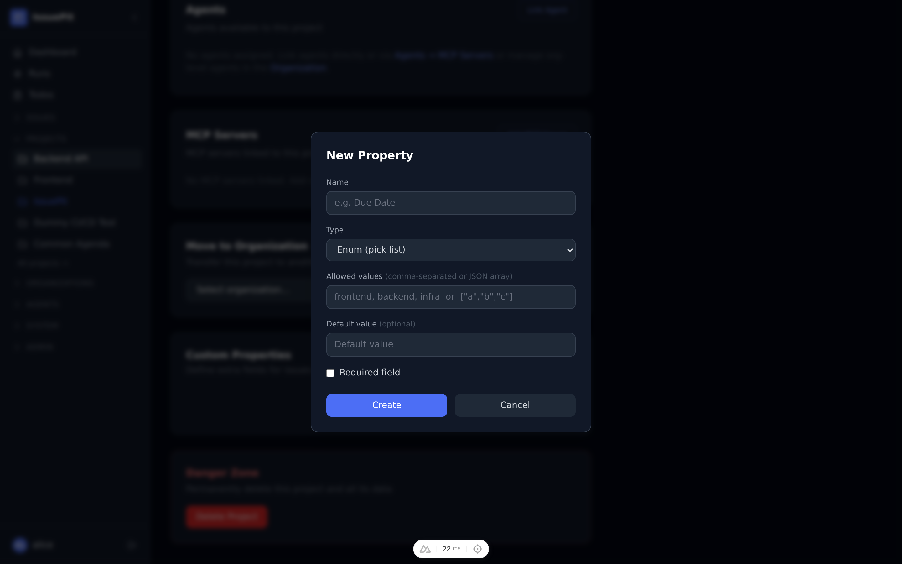

     - **Text** — minimum and maximum character length
     - **Number** — minimum and maximum numeric range

       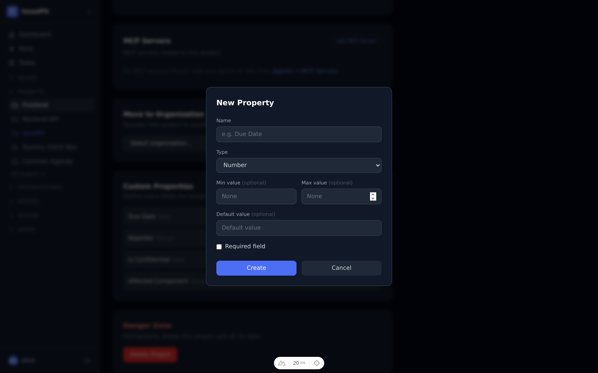

     - **Date** — minimum and maximum date

       

     - **Person / Agent** — allow multiple selections (optionally with a max count)
5. Click **Save**.

Custom property values are stored per issue and displayed inline in the issue detail view.

---

## Milestones

Milestones let you group issues into time-boxed deliverables and track progress towards a goal.

### Creating a milestone

1. Open your project.
2. Click **Milestones** in the Quick Navigation panel on the project overview, or navigate to the Milestones page from the sidebar.
3. Click **+ New Milestone**.
4. Set a **Title**, optional **Description**, **Start Date**, and **Due Date**.
5. Click **Create Milestone**.

Once a milestone exists, you can assign any issue to it from the issue detail page using the **Milestone** selector.

### List and Gantt views

The milestone list page has three view modes controlled by the toggle in the top-right corner:

| Mode | Description |
|------|-------------|
| **List** | Card-based list of milestones with status, dates, and actions |
| **Both** | List and Gantt chart shown simultaneously (default on larger screens) |
| **Gantt** | Timeline chart only |

#### Gantt chart

Each milestone is rendered as a horizontal bar spanning its start–due date range. Open milestones are shown in indigo; closed milestones in gray. A vertical line marks today.

**Interaction:**
- **Click** a bar or its label to open the milestone detail page.
- **Drag** the middle of a bar to shift its start and due dates.
- **Drag** the left or right edge of a bar to resize it (changing only the start or due date).
  All date changes are saved automatically via the API.

### Milestone detail page

Click any milestone row or Gantt bar to open the detail page.

The detail page shows:
- **Progress bar** with percentage of issues completed
- **Open / In Progress / Done** issue counts
- **Issues table** listing all issues assigned to this milestone
- **Edit** button — opens an inline modal to change the title, description, start date, and due date
- **Close milestone / Reopen milestone** button — toggles the milestone status

---

## Sub-issues

Any issue can have child issues (sub-issues) to break large tasks into smaller pieces.

1. Open an issue.
2. Scroll to the **Sub-issues** section.
3. Click **Add Sub-issue**.
4. Search for an existing issue or create a new one inline.

Sub-issues appear indented under their parent and their completion is reflected in a progress indicator on the parent issue.

---

## Issue Linking

Issues can be related to each other using typed links that capture the nature of the relationship.

On any issue detail page:

1. Scroll to **Linked Issues**.
2. Click **Add link**.
3. Choose a **Link type**:

   | Type | Meaning |
   |------|---------|
   | **blocks** | This issue must be resolved before the linked issue can start |
   | **blocked by** | This issue cannot start until the linked issue is resolved |
   | **causes** | This issue is the root cause of the linked issue |
   | **caused by** | This issue is caused by the linked issue |
   | **solves** | This issue provides the solution for the linked issue |
   | **duplicates** | This issue is a duplicate of the linked issue |
   | **requires** | This issue depends on the linked issue |
   | **implements** | This issue implements the requirement in the linked issue |
   | **linked to** | A general relationship with no specific directionality |

4. Search for and select the target issue (cross-project search is supported).
5. Click **Add**.

Links are always shown on both issues and are clearly labelled with a **↗ cross-project** badge when the linked issue belongs to a different project.

---

## Issue History

Every change to an issue is recorded in the **History** tab of the issue detail page. The audit trail includes:

- Status changes
- Assignee additions and removals
- Priority changes
- Title and description edits
- Comments and reactions

Open any issue and switch to the **History** tab to see the full timeline of changes.

---

## Code Review

When a project has a linked Git repository, the **Code Review** tab gives you a side-by-side diff viewer to review changed files between branches.

1. Open your project.
2. Go to **Code Review**.
3. Select a **Base branch** and a **Compare branch** — the diff loads automatically on branch change.
4. Click any file in the sidebar to view its diff.
5. Click any line in the diff to leave an inline comment.

---

## Merge Requests

The **Merge Requests** tab shows lightweight merge request proposals for your linked repository.

1. Open your project.
2. Go to **Merge Requests**.
3. Click **New Merge Request**.
4. Select the **Source branch** and **Target branch**.
5. Add a title and description, then click **Create**.

IssuePit can auto-merge a merge request when all required checks pass.

---

## Runs {#runs}

The **Runs** tab shows a combined list of all agent sessions and CI/CD pipeline runs for the project.

- **Agent runs** — show the status and duration of each work agent session
- **CI/CD runs** — show the status of each pipeline execution with a link to the detail view

Click any run to open its detail page with logs, artifacts, and job status.

You can also view runs across all projects from the global **Runs** page in the sidebar.

---

## Test History

The **Test History** page (`Project → Runs → Test History`) surfaces all test results stored from CI/CD `.trx` artifact files into a queryable dashboard.

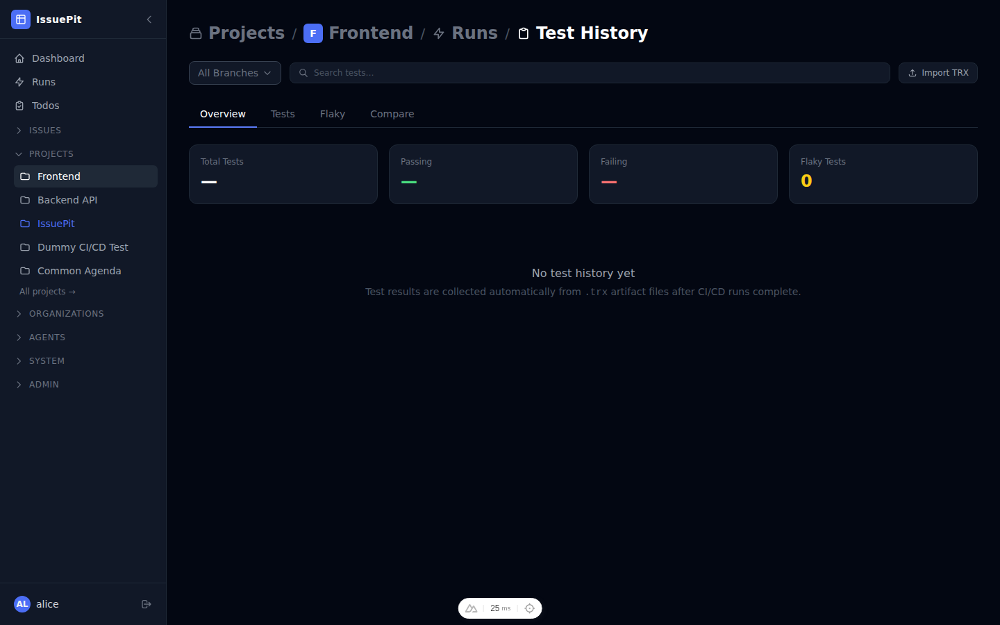

### Tabs

| Tab | Description |
|-----|-------------|
| **Overview** | Summary cards (total / passing / failing / flaky count), a stacked bar chart of pass/fail/skip per run, and a sortable run table |
| **Tests** | Searchable table of all unique tests with a `flaky` badge, fail %, average duration, and last outcome. Click any row for a slide-in panel showing per-run history with error messages and stack traces |
| **Flaky** | Filtered view of tests with mixed results. Use **Create Issue** to pre-fill a new issue with the test name, fail rate, and error context |
| **Compare** | Select two runs (baseline A and comparison B) to see a colour-coded diff: regressed (red), fixed (green), new tests (blue), removed tests (strikethrough), significantly slower tests (yellow) |

| Tests tab | Flaky tab |
|-----------|-----------|
| 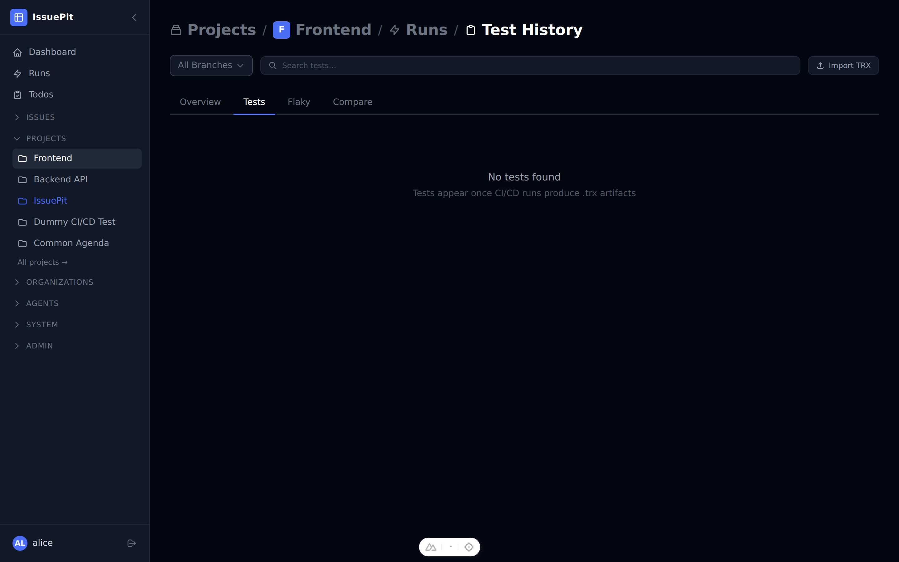 | 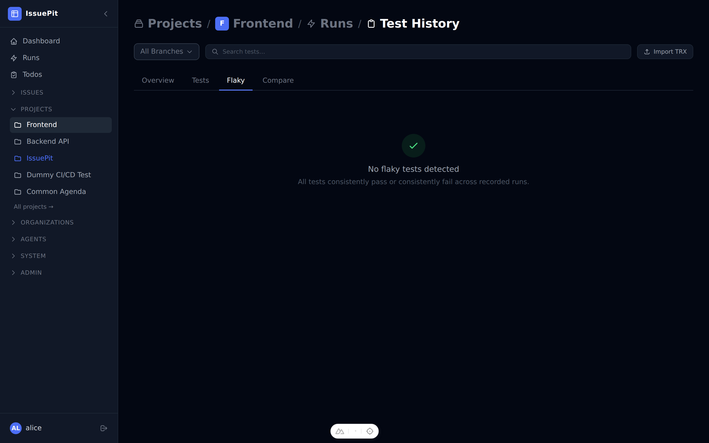 |

| Compare — picker | Compare — results |
|---|---|
|  |  |

### Importing TRX files

Click **Import TRX** (accessible from any tab) to upload a `.trx` file directly — useful for E2E runs that run outside CI. You can optionally specify a commit SHA, branch name, and artifact label.

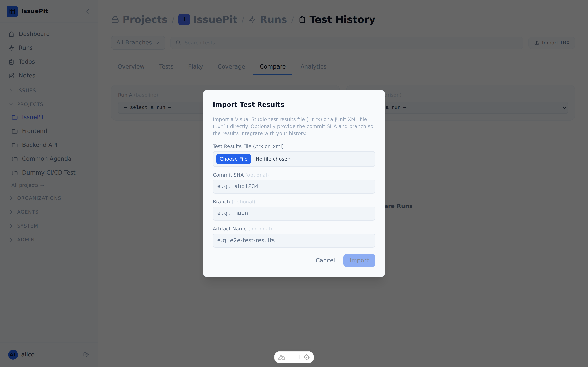

### MCP tools

Four MCP tools are available for AI-assisted analysis:

| Tool | Description |
|------|-------------|
| `get_test_history` | Run summaries for trend analysis |
| `get_test_list` | All tests sorted by failure count |
| `get_test_case_history` | Per-test flakiness history |
| `compare_test_runs` | Diff two runs: new / removed / fixed / regressed / slower |

---

## Next Steps

- [Configure AI agents →](agents)
- [Set up API keys →](configuration)
- [CI/CD Integration →](cicd)